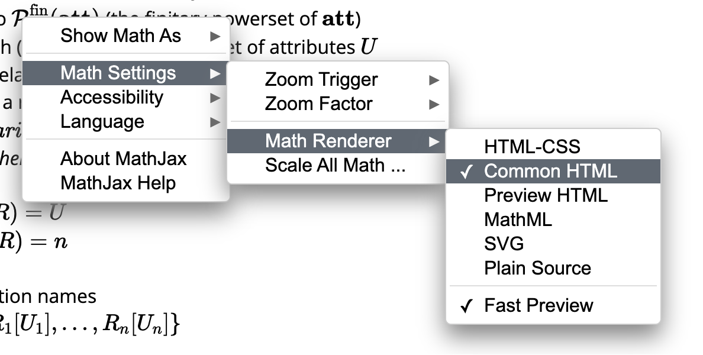

# Conjunctive Queries

<!-- prettier-ignore-start -->

> _Mathjax_ may have [issues](https://meta.stackexchange.com/questions/384924/i-think-there-is-a-mathjax-bug-for-mathcal-typesetting-on-some-platforms) to display math symbols in particular styles, such as \\(\mathcal{A}\\).  
> You can try to mitigate this by changing the _Math Renderer_ to _Common HTML_ (right click on any math expressions):
> 
\\( \newcommand{\att}{\textbf{att}} \\)
\\( \newcommand{\attTotalOrder}{\leq\_{\att}} \\)
\\( \newcommand{\dom}{\textbf{dom}} \\)
\\( \newcommand{\Dom}{\textit{Dom}} \\)
\\( \newcommand{\relname}{\textbf{relname}} \\)
\\( \newcommand{\sort}{\textit{sort}} \\)
\\( \newcommand{\arity}{\textit{arity}} \\)
\\( \newcommand{\finPowerSet}{\mathcal{P}^{\text{fin}}} \\)
\\( \newcommand{\dbschema}[1]{\textbf{#1}} \\)
\\( \newcommand{\dbinst}[1]{\textbf{#1}} \\)
\\( \newcommand{\rel}[1]{\textit{#1}} \\)
\\( \newcommand{\attname}[1]{\textit{#1}} \\)
\\( \newcommand{\varSet}{\textbf{var}} \\)
\\( \newcommand{\ans}{\textit{ans}} \\)
\\( \newcommand{\var}{\textit{var}} \\)
\\( \newcommand{\adom}{\textit{adom}} \\)
\\( \newcommand{\tableau}{\textbf{T}} \\)
\\( \newcommand{\free}{\textit{free}} \\)
\\( \newcommand{\body}{\text{body}} \\)

<!-- prettier-ignore-end -->

<!-- toc -->

a query (mapping) is _from_ (or _over_) its input schema and _to_ its output schema.

<!-- prettier-ignore-start -->

- _query_: a syntactic object
- _query mapping_: a function defined by a query interpreted under a specified semantics
  - its domain: the family of all instances of an input schema
  - its range: the family of instances of an output schema
  - we often blur query and query mapping when the meaning is clear from context
- _input schema_: a specified relation or database schema
- _output schema_: a relation schema or database schema
  - For a relation schema, the relation name may be specified as part of the query syntax or by the context
- \\(q_1 \equiv q_2\\) denotes two queries \\(q_1\\) and \\(q_2\\) over \\(\dbschema{R}\\) are _equivalent_,
  i.e., they have the same output schema and \\(q_1(\dbinst{I}) = q_2(\dbinst{I})\\) for each instance \\(\dbinst{I}\\) over \\(\dbschema{R}\\).

<!-- prettier-ignore-end -->

## Logic-Based Perspective

Three versions of conjunctive queries:

1. Rule-Based Conjunctive Queries
1. Tableau Queries
1. Conjunctive Calculus

### Rule-Based Conjunctive Queries

#### Definition

<!-- prettier-ignore-start -->

A _rule-based conjunctive query_ (or often more simply called _rules_) \\(q\\) over a relation schema \\(\dbschema{R}\\) is an expression of the form
\\[
\ans(u) \leftarrow \rel{R}_1(u_1), \ldots, \rel{R}_n(u_n)
\\]
where \\(n \geq 0\\), \\(\rel{R}_1, \ldots, \rel{R}_n\\) are relation names in \\(\dbschema{R}\\);
\\(\ans\\) is a relation name not in \\(\dbschema{R}\\);
and \\(u, u_1, \ldots, u_n\\) are free tuples (i.e., may use either variables or constants).

- \\(\var(q)\\): the set of variables occurring in \\(q\\).
- _body_: \\(\rel{R}_1(u_1), \ldots, \rel{R}_n(u_n)\\)
- _head_: \\(\ans(u)\\)
- _range restricted_: each variable occurring in the head also occurs in the body
  - all conjunctive queries considered here are range restricted
- _valuation_: a valuation \\(v\\) over \\(V\\), a finite subset of \\(\varSet\\), is a total function \\(v\\) from \\(V\\) to \\(\dom\\) (of constants)
    - extended to be identity on \\(\dom\\) (so that the domain can contain both variables and constants)
    - extended to map free tuples to tuples (so that the domain/range can be in the tuple form)

<!-- prettier-ignore-end -->

#### Semantics

Let \\(q\\) be the query, and let \\(\dbinst{I}\\) be a database instance of schema \\(\dbschema{R}\\).
The _image_ of \\(\dbinst{I}\\) under \\(q\\) is:

<!-- prettier-ignore-start -->

\\[
q(\dbinst{I}) = \\{ v(u) \mid v \text{ is a valuation over } \var(q) \text{ and } v(u_i) \in \dbinst{I}(\rel{R}_i) \text{ for each } i \in [1, n] \\}
\\]

- _active domain_ 
  - of a database instance \\(\dbinst{I}\\), denoted \\(\adom(\dbinst{I})\\), is the set of constants that occur in \\(\dbinst{I}\\)
  - of a relation instance \\(I\\), denoted \\(\adom(I)\\), is the set of constants that occur in \\(I\\)
  - of a query \\(q\\), denoted \\(\adom(q)\\), is the set of constants that occur in \\(q\\)
  - \\(\adom(q, \dbinst{I})\\) is an abbreviation for \\(\adom(q) \cup \adom(\dbinst{I})\\)
    - \\(\adom(q(\dbinst{I})) \subseteq \adom(q, \dbinst{I})\\)
- _extensional_ relations: relations in the body of the query, i.e., \\(\rel{R}_1, \ldots, \rel{R}_n\\)
  - because they are known/provided by the input instance \\(\dbinst{I}\\)
- _intensional_ relation: the relation in the head of the query, i.e., \\(\ans\\)
  - because it is not stored and its value is computed on request by the query
- _extensional database (edb)_: a database instance associated with the extensional relations
- _intensional database (idb)_: the rule itself
- _idb relation_: the relation defined by the idb

<!-- prettier-ignore-end -->

#### Properties

Conjunctive queries are:

- _monotonic_: a query \\(q\\) over \\(\dbschema{R}\\) is monotonic if for each \\(\dbinst{I}, \dbinst{J}\\) over \\(\dbschema{R}\\),
  \\(\dbinst{I} \subseteq \dbinst{J} \implies q(\dbinst{I}) \subseteq q(\dbinst{J})\\)
- _satisfiable_: a query \\(q\\) is satisfiable if there exists a database instance \\(\dbinst{I}\\) such that \\(q(\dbinst{I}) \neq \emptyset\\)

### Tableau Queries

A _tableau query_ is simply a pair \\((\tableau, u)\\) where \\(\tableau\\) is a tableau
and each variable in \\(u\\) also occurs in \\(\tableau\\).

This is closest to the visual form provided by Query-By-Example (QBE).

- _summary_: the free tuple \\(u\\) representing the tuples included in the answer to the query
- _embedding_: a valuation \\(v\\) for the variables occurring in \\(\tableau\\) such that \\(v(\tableau) \subseteq \dbinst{I}\\)
  - the output of \\((\tableau, u)\\) on \\(\dbinst{I}\\) consists of all tuples \\(v(u)\\) for each embedding \\(v\\) of \\(\tableau\\) into \\(\dbinst{I}\\)
- _typed_: a tableau query \\(q = (\tableau, u)\\) under the named perspective, where \\(\tableau\\) is
  over relation schema \\(R\\) and \\(\sort(u) \subseteq \sort(R)\\), is typed if no variable of \\(\tableau\\)
  is associated with two distinct attributes in \\(q\\)

#### Examples

Table _Movies_

| Title         | Director  | Actor         |
| ------------- | --------- | ------------- |
| \\(x\_{ti}\\) | "Bergman" | \\(x\_{ac}\\) |

Table _Location_

| Theater       | Address       | Phone     |
| ------------- | ------------- | --------- |
| \\(x\_{th}\\) | \\(x\_{ad}\\) | \\(x_p\\) |

Table _Pariscope_

| Theater       | Title         | Schedule     |
| ------------- | ------------- | ------------ |
| \\(x\_{th}\\) | \\(x\_{ti}\\) | \\(x\_{s}\\) |

The above tableau query is typed because each variable is associated with only one attribute:

- \\(x\_{ti}\\): \\(\attname{Title}\\)
- \\(x\_{ac}\\): \\(\attname{Actor}\\)
- \\(x\_{th}\\): \\(\attname{Theater}\\)
- \\(x\_{ad}\\): \\(\attname{Address}\\)
- \\(x_p\\): \\(\attname{Phone}\\)
- \\(x\_{s}\\): \\(\attname{Schedule}\\)

However, the following tableau query is untyped:

Table _Movies_

| Title         | Director      | Actor         |
| ------------- | ------------- | ------------- |
| \\(x\_{ti}\\) | \\(x\_{ac}\\) | \\(x\_{ac}\\) |

Because \\(x\_{ac}\\) is associated with both \\(\attname{Director}\\) and \\(\attname{Actor}\\).

### Conjunctive Calculus

The conjunctive query
\\[
\ans(u) \leftarrow \rel{R}_1(u_1), \ldots, \rel{R}_n(u_n)
\\]

can be expressed as the following conjunctive calculus query that has the same semantics:
\\[
\left\\{ e_1, \ldots, e_m \vert \exists x_1, \ldots, x_k \left( \rel{R}(u_1) \wedge \ldots \wedge \rel{R}(u_n) \right) \right\\}
\\]
where \\(x_1, \ldots, x_k\\) are all the variables occurring in the body and not the head.

#### Conjunctive Calculus Formula

Let \\(\dbschema{R}\\) be a relation schema.
A _(well-formed) formula_ over \\(\dbschema{R}\\) for the conjunctive calculus is an expression having **one of** the following forms:

1. an atom over \\(\dbschema{R}\\);
2. \\(\varphi \wedge \psi \\), where \\(\varphi\\) and \\(\psi\\) are formulas over \\(\dbschema{R}\\); or
3. \\(\exists x \varphi\\), where \\(x\\) is a variable and \\(\varphi\\) is a formula over \\(\dbschema{R}\\).

An occurrence of a variable \\(x\\) in formula \\(\varphi\\) is _free_ if:

1. \\(\varphi\\) is an atom; or
2. \\(\varphi = (\psi \wedge \xi)\\) and the occurrence of \\(x\\) is free in \\(\psi\\) or \\(\xi\\); or
3. \\(\varphi = \exists y \psi\\), \\(x \neq y\\), and the occurrence of \\(x\\) is free in \\(\psi\\).

\\(\free(\varphi)\\): the set of free variables in \\(\varphi\\).

An occurrence of a variable that is not free is _bound_.

#### Conjunctive Calculus Query

A _conjunctive calculus query_ over database schema \\(\dbschema{R}\\) is an expression of the form
\\[
\\{ e_1, \ldots, e_m \mid \varphi \\}
\\]
where

- \\(\varphi\\) is a conjunctive calculus formula,
- \\(\langle e_1, \ldots, e_m \rangle\\) is a free tuple, and
- the set of variables occurring in \\(\langle e_1, \ldots, e_m \rangle\\) is exactly \\(\free(\varphi)\\).

For named perspective, the above query can be written as:
\\[
\\{ \langle e_1, \ldots, e_m \rangle : A_1, \ldots, A_m \mid \varphi \\}
\\]

> Note: In the previous chapter, a named tuple was usually denoted as:
>
> \\[ \langle A_1:a_1, \ldots, A_m:a_m \rangle \\]
>
> But here we denote the named tuple as:
>
> \\[ \langle e_1, \ldots, e_m \rangle : A_1, \ldots, A_m \\]
>
> Not sure which one is better or whether the author did this intentionally.

#### Semantics

##### Valuation

A _valuation_ over \\(V \subset \varSet \\) is a total function \\(v\\) from \\(V\\) to \\(\dom\\),
which can be viewed as a syntactic expression of the form:
\\[
\\{ x_1/a_1, \ldots, x_n/a_n \\}
\\]
where

- \\(x_1, \ldots, x_n\\) is a listing of \\(V\\),
- \\(a_i = v(x_i)\\) for each \\(i \in [1, n]\\).

##### Interpretation as a Set

If \\(x \not \in V\\), and \\(c \in \dom\\),
then \\(v \cup \\{ x/c \\}\\) is the valuation over \\(V \cup \\{ x \\}\\)
that agrees with \\(v\\) on \\(V\\) and maps \\(x\\) to \\(c\\).

##### Satisfaction

Let \\(\dbschema{R}\\) be a database schema, \\(\varphi\\) a conjunctive calculus formula over \\(\dbschema{R}\\),
and \\(v\\) a valuation over \\(\free(\varphi)\\).
Then \\(\dbinst{I} \models \varphi[v]\\), if

1. \\(\varphi = \rel{R}(u)\\) is an atom and \\(v(u) \in \dbinst{I}(\rel{R})\\); or
2. \\(\varphi = (\psi \wedge \xi)\\) and \\(\dbinst{I} \models \psi[v \vert_{\free(\psi)}]\\) and \\(\dbinst{I} \models \xi[v \vert_{\free(\xi)}]\\); or
3. \\(\varphi = \exists x \psi\\) and there exists a constant \\(c \in \dom\\) such that
   \\(\dbinst{I} \models \psi[v \cup \\{ x/c \\}]\\).

##### Image

<!-- prettier-ignore-start -->

Let \\(q = \\{ e_1, \ldots, e_m \mid \varphi \\}\\) be a conjunctive calculus query over \\(\dbschema{R}\\).
For an instance \\(\dbinst{I}\\) over \\(\dbschema{R}\\), the _image_ of \\(\dbinst{I}\\) under \\(q\\) is:
\\[
q(\dbinst{I}) = \\{ v( \langle e_1, \ldots, e_m \rangle ) \mid v \text{ is a valuation over } \free(\varphi) \text{ and } \dbinst{I} \models \varphi[v] \\}
\\]

<!-- prettier-ignore-end -->

- _active domain_
  - of a formula \\(\varphi\\), denoted \\(\adom(\varphi)\\), is the set of constants that occur in \\(\varphi\\)
  - \\(\adom(\varphi, \dbinst{I})\\) is an abbreviation for \\(\adom(\varphi) \cup \adom(\dbinst{I})\\)
  - If \\(\dbinst{I} \models \varphi[v]\\), then the range of \\(v\\) is contained in \\(\adom(\dbinst{I})\\)
    - to evaluate a conjunctive calculus query, one need only consider valuations with range constrained in \\(\adom(\varphi, \dbinst{I})\\),
      i.e., only a finite number of them
- _equivalent_: conjunctive calculus formulas \\(\varphi\\) and \\(\psi\\) over \\(\dbschema{R}\\) are equivalent,
  if
  - they have the same free variables and,
  - for each \\(\dbinst{I}\\) over \\(\dbschema{R}\\) and valuation \\(v\\) over \\(\free(\varphi) = \free(\psi)\\),
    \\(\dbinst{I} \models \varphi[v]\\) if and only if \\(\dbinst{I} \models \psi[v]\\)

#### Normal Form

\\[
\exists x_1, \ldots, x_m \left( \rel{R}_1(u_1) \wedge \ldots \wedge \rel{R}_n(u_n) \right)
\\]

Each conjunctive calculus query is equivalent to a conjunctive calculus query in normal form.

### Expressiveness of Query Languages

<!-- prettier-ignore-start -->

Let \\(\mathcal{Q}_1\\) and \\(\mathcal{Q}_2\\) be two query languages.

- \\(\mathcal{Q}_1 \sqsubseteq \mathcal{Q}_2\\): 
  \\(\mathcal{Q}_1\\) is _dominated_ by \\(\mathcal{Q}_2\\) 
  (or \\(\mathcal{Q}_2\\) is _weaker_ than \\(\mathcal{Q}_1\\)),
  if for each query \\(q_1 \in \mathcal{Q}_1\\),
  there exists a query \\(q_2 \in \mathcal{Q}_2\\) such that \\(q_1 \equiv q_2\\).
- \\(\mathcal{Q}_1 \equiv \mathcal{Q}_2\\): 
  \\(\mathcal{Q}_1\\) and \\(\mathcal{Q}_2\\) are _equivalent_,
  if \\(\mathcal{Q}_1 \sqsubseteq \mathcal{Q}_2\\) and \\(\mathcal{Q}_2 \sqsubseteq \mathcal{Q}_1\\).

<!-- prettier-ignore-end -->

The rule-based conjunctive queries, tableau queries, and conjunctive calculus queries are all equivalent.

## Incorporating Equality

The conjunctive query

\\[
\begin{split}
\ans(x_{th}, x_{ad}) \leftarrow & \rel{Movies}(x_{ti}, \text{"Bergman"}, x_{ac}), \\\\
& \qquad \rel{Location}(x_{th}, x_{ad}, x_p), \rel{Pariscope}(x_{th}, x_{ti}, x_s)
\end{split}
\\]

can be expressed as:

\\[
\begin{split}
\ans(x_{th}, x_{ad}) \leftarrow & \rel{Movies}(x_{ti}, x_d, x_{ac}), x_d = \text{"Bergman"}, \\\\
& \qquad \rel{Location}(x_{th}, x_{ad}, x_p), \rel{Pariscope}(x_{th}, x_{ti}, x_s)
\end{split}
\\]

### Problem 1: Infinite Answers

Unrestricted rules with equality may yield infinite answers:
\\[
\ans(x, y) \leftarrow \rel{R}(x), y = z
\\]

A _rule-based conjunctive query with equality_ is a _range-restricted_ rule-based conjunctive query with equality.

### Problem 2: Unsatisfiable Queries

Consider the following query:
\\[
\ans(x) \leftarrow \rel{R}(x), x = a, x = b
\\]
where \\(\rel{R}\\) is a unary relation and \\(a, b \in \dom\\) with \\(a \neq b\\).

Each satisfiable rule with equality is equivalent to a rule without equality.  
No expressive power is gained if the query is satisfiable.

## Query Composition and Views

a _conjunctive query program_ (with or without equality) is a sequence \\(P\\)
of rules having the form:
\\[
\begin{split}
S_1(u_1) & \leftarrow \text{body}_1 \\\\
S_2(u_2) & \leftarrow \text{body}_2 \\\\
& \vdots \\\\
S_m(u_m) & \leftarrow \text{body}_m
\end{split}
\\]
where

<!-- prettier-ignore-start -->

- each \\(S_i\\) is a distinct relation name not in \\(\dbschema{R}\\),
- for each \\(i \in [1, m]\\), the only relation names that may occur in \\(\body_i\\) are in \\(\dbschema{R} \cup \\{ S_1, \ldots, S_{i-1} \\}\\).

<!-- prettier-ignore-end -->

### Closure under Composition

If conjunctive query program \\(P\\) defines final relation \\(S\\),
then there is a conjunctive query \\(q\\),
possibly with equality,
such that on all input instances \\(\dbinst{I}\\),
\\(q(\dbinst{I}) = P(\dbinst{I})(S)\\).

If \\(P\\) is satisfiable, then there is a \\(q\\) without equality.

### Composition and User Views

_views_ are specified as queries (or query programs), which may be

- _materialized_: a physical copy of the view is stored and maintained
- _virtual_: relevant information about the view is computed as needed
  - queries against the virtual view generate composed queries against the underlying database

## Algebraic Perspectives

### The Unnamed Perspective: The SPC Algebra

Unnamed conjunctive algebra:

- **S**election (\\(\sigma\\))
- **P**rojection (\\(\pi\\))
- **C**ross-Product (or Cartesian Product, \\(\times\\))

<!-- prettier-ignore-start -->

#### Selection ("Horizontal" Operator)

Primitive Forms: \\(\sigma_{j=a}\\) and \\(\sigma_{j=k}\\)  
where \\(j, k\\) are positive integers, and \\(a \in \dom\\) 
(constants are usually surrounded by quotes).

\\[
\sigma_{j=a}(I) = \\{ t \in I \mid t(j) = a \\}
\\]

\\(\sigma_{j=k}\\) is sometimes called _atomic_ selection.

#### Projection ("Vertical" Operator)

General Form: \\(\pi_{j_1, \ldots, j_n}\\)  
where \\(n \geq 0\\) and \\(j_1, \ldots, j_n\\) are positive integers 
(empty sequence is written \\([\\;]\\)).

\\[
\pi_{j_1, \ldots, j_n}(I) = \\{ \langle t(j_1), \ldots, t(j_n) \rangle \mid t \in I \\}
\\]

#### Cross-Product (or Cartesian Product)

\\[
I \times J = \\{ \langle t(1), \ldots, t(n), s(1), \ldots, s(m) \\rangle \mid t \in I, s \in J \\}
\\]

#### Formal Inductive Definition

Let \\(\dbschema{R}\\) be a relation schema.

There are two kinds of *base SPC (algebra) queries*:

1. _Input Relation_: Expression \\(R\\); with arity equal to \\(\arity(R)\\)
1. _Unary Singleton Constant_: Expression \\(\\{\langle a \rangle \\}\\),
  where \\(a \in \dom\\); with arity equal to 1

The family of _SPC (algebra) queries_ contains all above *base SPC queries* and,
for SPC queries \\(q_1, q_2\\) with arities \\(\alpha_1, \alpha_2\\), respectively,

- _Selection_: \\(\sigma_{j=1}(q_1)\\) and \\(\sigma_{j=k}(q_1)\\),
  whenever \\(j, k \leq \alpha_1\\) and \\(a \in \dom\\); these have arity \\(\alpha_1\\).
- _Projection_: \\(\pi_{j_1, \ldots, j_n}(q_1)\\),
  where \\(j_1, \ldots, j_n \leq \alpha_1\\); this has arity \\(n\\).
- _Cross-Product_: \\(q_1 \times q_2\\); this has arity \\(\alpha_1 + \alpha_2\\).

#### Unsatisifiable Queries

E.g. \\(\sigma_{1=a}(\sigma_{1=b}(R))\\) where \\(\arity(R) \geq 1\\) and \\(a \neq b\\).

This is equivalent to \\(q^\emptyset\\).

#### Generalized SPC Algebra

- _Intersection_ (\\(\cap\\)): is easily simulated by selection and cross-product.
- _Generalized Selection_ (\\(\sigma\\)): permits the specification of multiple conditions.
  - _Positive Conjunctive Selection Formula_: \\(F = \gamma_1 \land \ldots \land \gamma_n (n \geq 1)\\) where each \\(\gamma_i\\) is either \\(j = k\\) or \\(j = a\\)
  - _Positive Conjunctive Selection Operator_: an expression of the form \\(\sigma_F\\), where \\(F\\) is a positive conjunctive selection formula
  - can be simulated by a sequence of selections
- _Equi-Join_ (\\(\bowtie\\)): a binary operator that combines cross-product and selection
  - _Equi-Join Condition_: \\(F = \gamma_1 \land \ldots \land \gamma_n (n \geq 1)\\) where each \\(\gamma_i\\) is of the form \\(j = k\\)
  - _Equi-Join Operator_: an expression of the form \\(I \bowtie_F J\\), where \\(F\\) is an equi-join condition
  - can be simulated by \\(\sigma_{F'}(I \times J)\\),
    where \\(F'\\) is obtained from \\(F\\) by replacing each
    condition \\(j = k\\) with \\(j = \alpha(I) + k\\)

#### Normal Form

\\[
\pi_{j_1, \ldots, j_n}( \\{ \langle a_1 \rangle \\} \times \ldots \times \\{ \langle a_m \rangle \\} \times \sigma_F(R_1 \times \ldots \times R_k) )
\\]
where

- \\(n \geq 0; m \geq 0\\);
- \\(a_1, \ldots, a_m \in \dom\\);
- \\(\\{1, \ldots, m\\} \subseteq \\{j_1, \ldots, j_n\\}\\);
- \\(R_1, \ldots, R_k\\) are relation names (repeats permitted);
- \\(F\\) is a positive conjunctive selection formula.

For each (generalized) SPC query, there is an equivalent SPC query in normal form.

The proof is based on repeated application of the following _equivalence-preserving SPC algebra rewrite rules_ (or _transformations_):

- _Merge-Select_:
  \\[
  \sigma_{F}( \sigma_{F'}(q) ) \equiv \sigma_{F \land F'}(q)
  \\]
- _Merge-Project_:
  \\[
  \pi_{\boldsymbol{j}}( \pi_{\boldsymbol{k}}(q) ) \equiv \pi_{\boldsymbol{l}}(q), \text{ where } l_i = k_{j_i} \text{ for each term } l_i \text{ in } \boldsymbol{l}
  \\]
- _Push-Select-Though-Project_:
  \\[
  \sigma_F( \pi_{\boldsymbol{j}}(q) ) \equiv \pi_{\boldsymbol{j}}( \sigma_{F'}(q) ), \text{ where } F' \text{ is obtained from } F \text{ by replacing each } k \text{ with } j_k
  \\]
- _Push-Select-Though-Singleton_:
  \\[
  \sigma_{1=j}(\langle a \rangle \times q) \equiv \langle a \rangle \times \sigma_{(j - 1) = a}(q)
  \\]
- _Associate-Cross_:
  \\[
  (q_1 \times \ldots \times q_n) \times q \equiv q_1 \times \ldots \times q_n \times q
  \\]
  \\[
  q \times (q_1 \times \ldots \times q_n) \equiv q_1 \times \ldots \times q_n \times q
  \\]
- _Commute-Cross_:
  \\[
  (q \times q') \equiv \pi_{\boldsymbol{j} \boldsymbol{j'}} (q' \times q)
  \\]
  where \\(\boldsymbol{j'} = [1, \ldots, \arity(q')]\\) and \\(\boldsymbol{j} = [\arity(q') + 1, \ldots, \arity(q') + \arity(q)]\\)
- _Push-Cross-Though-Select_:
  \\[
  \sigma_F(q) \times q' \equiv \sigma_{F}(q \times q')
  \\]
  \\[
  q \times \sigma_F(q') \equiv \sigma_{F'}(q \times q')
  \\]
  where \\(F'\\) is obtained from \\(F\\) by replacing each \\(j\\) with \\(\arity(q) + j\\)
- _Push-Cross-Though-Project_:
  \\[
  \pi_{\boldsymbol{j}}(q) \times q' \equiv \pi_{\boldsymbol{j}}(q \times q')
  \\]
  \\[
  q \times \pi_{\boldsymbol{j}}(q') \equiv \pi_{\boldsymbol{j'}}(q \times q')
  \\]
  where \\(\boldsymbol{j'}\\) is obtained from \\(\boldsymbol{j}\\) by replacing each \\(j\\) with \\(\arity(q) + j\\)

##### Notation for Rewriting

\\[
\begin{split}
q &\rightarrow_{\mathcal{S}} q' \quad \text{or} \\\\
\text{simply} \quad q &\rightarrow q'
\end{split}
\\]

- for a set \\(\mathcal{S}\\) of rewrite rules and algebra expressions \\(q, q'\\),
- if \\(\mathcal{S}\\) is understood from the context,
- if \\(q'\\) is the result of replacing a subexpression of \\(q\\)
  according to one of the rules in \\(\mathcal{S}\\).

\\(\rightarrow^*_S\\): the reflexive and transitive closure of \\(\rightarrow\\).

A family \\(\mathcal{S}\\) of rewrite rules is _sound_
if \\(q \rightarrow_{\mathcal{S}} q'\\) implies \\(q \equiv q'\\).
If \\(\mathcal{S}\\) is sound, then \\(q \rightarrow^*_{\mathcal{S}} q'\\) implies \\(q \equiv q'\\).

### The Named Perspective: The SPJR Algebra

Named conjunctive algebra:

- **S**election (\\(\sigma\\))
- **P**rojection (\\(\pi\\)); repeats not permitted 
- **J**oin (\\(\bowtie\\)); natural join
- **R**enaming (\\(\\delta\\))

#### Selection

\\(\sigma_{A=a}, \sigma_{A=B}\\) where \\(A, B \in \att, a \in \dom\\)

These operators apply to any instance \\(I\\) with \\(A, B \in \sort(I)\\).

#### Projection

\\(\pi_{A_1, \ldots, A_n}\\) where \\(n \geq 0\\) and \\(A_1, \ldots, A_n \in \sort(I)\\)

#### (Natural) Join

\\[
\begin{split}
I \bowtie J = \\{ t \text{ over } V \cup W \vert & \text{ for some } v \in I \text{ and } w \in J, \\\\
& \quad t[V] = v \land t[W] = w \\}
\end{split}
\\]
where \\(I\\) and \\(J\\) have sorts \\(V\\) and \\(W\\), respectively.

- When \\(\sort(I) = \sort(J)\\), \\(I \bowtie J = I \cap J\\).
- When \\(\sort(I) \cap \sort(J) = \emptyset\\), \\(I \bowtie J = I \times J\\).

#### Renaming

An _attribute renaming_ for a finite set \\(U\\) of attributes
is a one-one mapping from \\(U\\) to \\(\att\\).

\\[
\delta_f(I) = \\{ v \text{ over } f[U] \vert \text{ for some } u \in I, v(f(A)) = u(A) \text{ for each } A \in U \\}
\\]
where 

- input is an instance \\(I\\) over \\(U\\)
- \\(f\\) is an attribute renaming for \\(U\\)
  - which can be described by \\((A, f(A))\\), where \\(f(A) \neq A\\)
    - usually written as \\(A_1 A_2 \ldots A_n \rightarrow B_1 B_2 \ldots B_n\\) to indicate that \\(f(A_i) = B_i\\) for each \\(i \in [1, n] (n \geq 0)\\)

#### Formal Inductive Definition

The _base SPJR algebra queries_ are:

1. _Input Relation_: Expression \\(R\\); with sort equal to \\(\sort(R)\\)
2. _Unary Singleton Constant_: Expression \\(\\{ \langle A:a \rangle \\}\\),
   where \\(a \in \dom\\); with \\(\sort = A\\)

The remainder of the syntax and semantics of the SPJR algebra is defined in analogy to those of the SPC algebra.

#### Normal Form

\\[
\pi_{B_1, \ldots, B_m}( \\{ \langle A_1:a_1 \rangle \\} \bowtie \ldots \bowtie \\{ \langle A_m:a_m \rangle \\} \bowtie \sigma_F(\delta_{f_1}(R_1) \bowtie \ldots \bowtie \delta_{f_k}(R_k)) )
\\]
where

- \\(n \geq 0; m \geq 0\\);
- \\(a_1, \ldots, a_m \in \dom\\);
- \\(\{A_1, \ldots, A_m\}\\) occurs in \\(\{B_1, \ldots, B_n\}\\);
- the \\(A_i\\)s are distinct;
- \\(R_1, \ldots, R_k\\) are relation names (repeats permitted);
- \\(\delta_{f_i}\\) is a renaming operator for \\(\sort(R_i)\\);
- no \\(A_i\\) occur in any \\(\delta_{f_j}(R_j)\\);
- the sorts of \\(\delta_{f_1}(R_1), \ldots, \delta_{f_k}(R_k)\\) are pairwise disjoint;
- \\(F\\) is a positive conjunctive selection formula.

For each SPJR query, there is an equivalent SPJR query in normal form.

<!-- prettier-ignore-end -->

### Equivalence Theorem

- _Lemma_: The SPC and SPJR algebras are equivalent.
- _Equivalence Theorem_: The rule-based conjunctive queries, tableau queries, conjunctive calculus queries, satisifiable SPC algebra, and satisifiable SPJR algebra are all equivalent.

## Adding Union

The following have equivalent expressive power:

- the nonrecursive datalog programs (with single relation target)
- the SPCU queries
- the SPJRU queries
  - union can only be applied to expressions having the same sort

### Nonrecursive Datalog Program {#nonrecursive-datalog-program}

A _nonrecursive datalog program (nr-datalog program)_ over schema \\(\dbschema{R}\\) is a set of rules:

\\[
\begin{split}
S_1 & \leftarrow \body_1 \\\\
S_2 & \leftarrow \body_2 \\\\
& \vdots \\\\
S_m & \leftarrow \body_m
\end{split}
\\]
where

- no relation name in \\(\dbschema{R}\\) occurs in  a rule head
- the same relation name may appear in more than one rule head
- there is some ordering \\(r_1, \ldots, r_m\\) of the rules such that
  the relation name in the head of \\(r_i\\) does not occur in the body of any rule \\(r_j\\) with \\(j \leq i\\)

### Union and the Conjunctive Calculus

Simply permitting disjunction (denoted \\(\lor\\)) in the formula of a conjunctive calculus along with conjunction can have serious consequences.

E.g.,

\\[
q = \\{ x, y, z \vert R(x, y) \lor R(y, z) \\}
\\]

The answer of \\(q\\) on nonempty instance \\(I\\) will be

\\[
q(I)= (I \times \dom) \cup (\dom \times I)
\\]

Because \\(R(x, y)\\) decides that the first two components in \\(\langle x, y, z \rangle\\) are in \\(I\\) and \\(z\\) can be anything in \\(\dom\\),
and \\(R(y, z)\\) decides that the last two components in \\(\langle x, y, z \rangle\\) are in \\(I\\) and \\(x\\) can be anything in \\(\dom\\).
