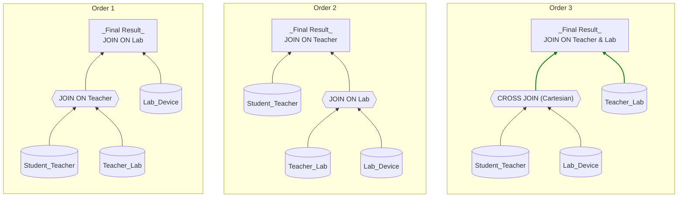
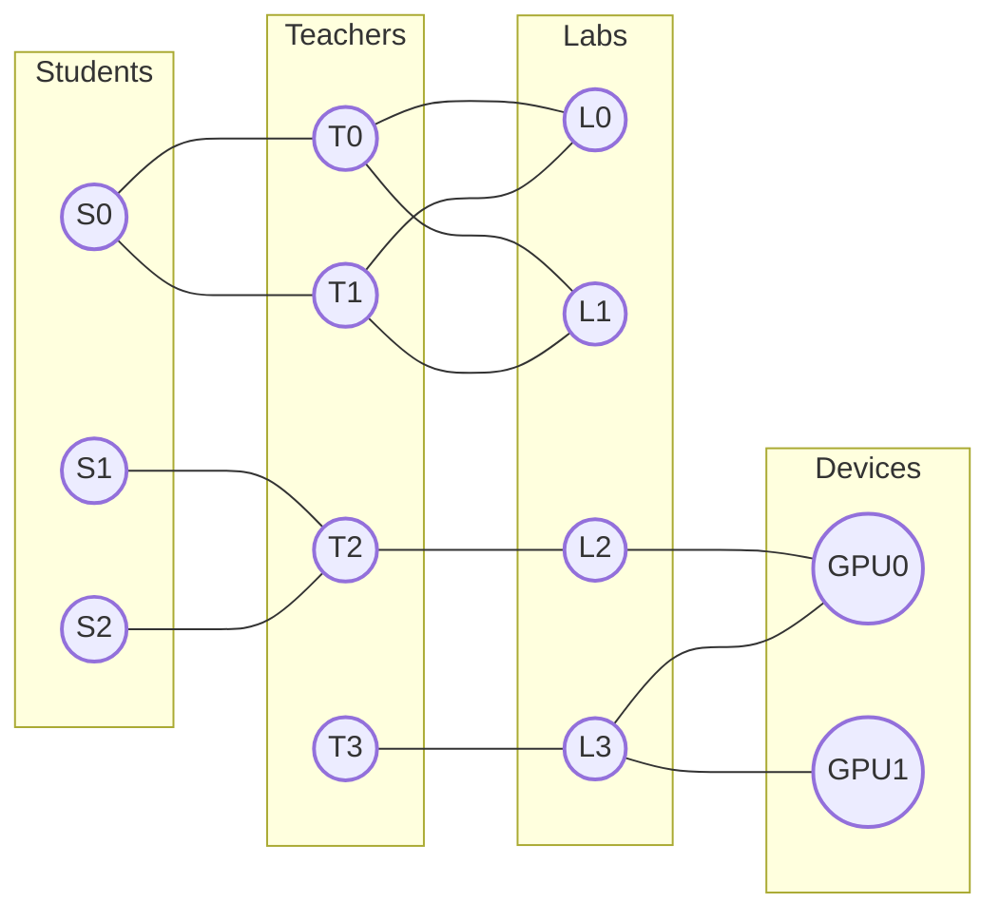
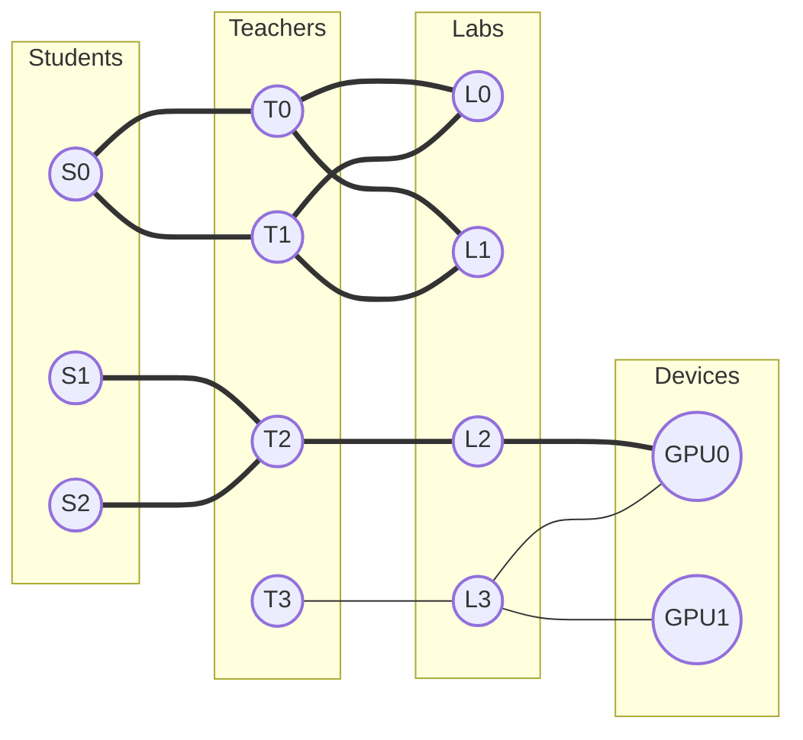
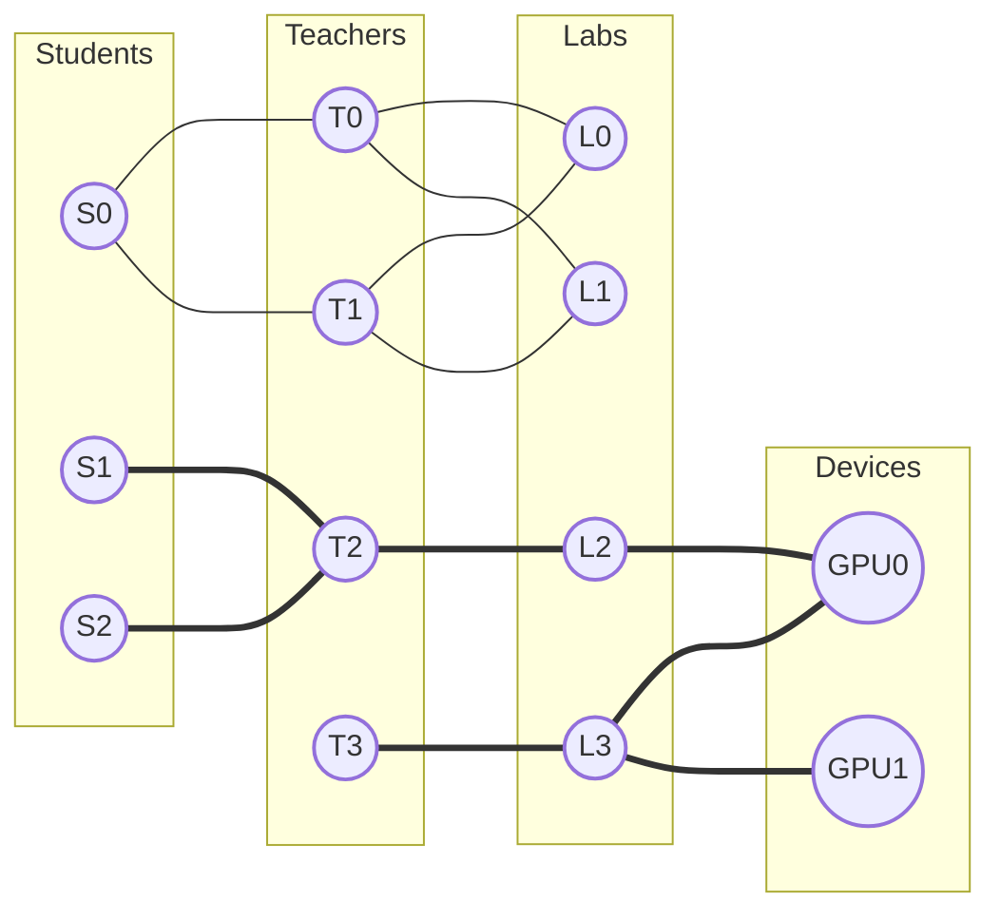
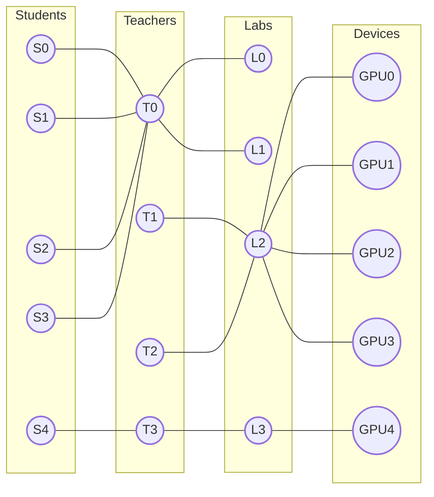
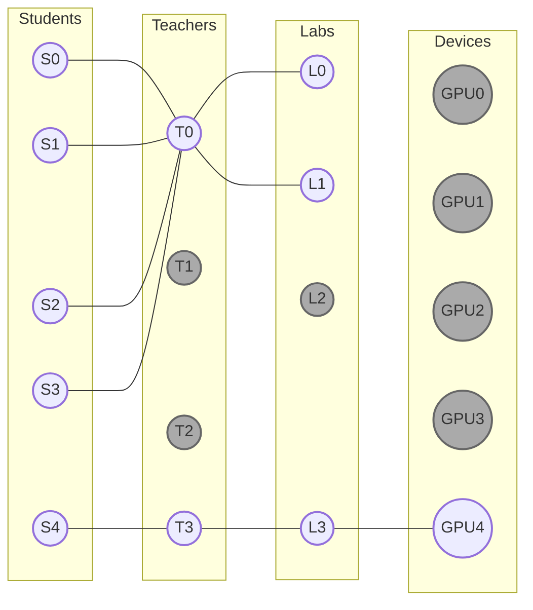
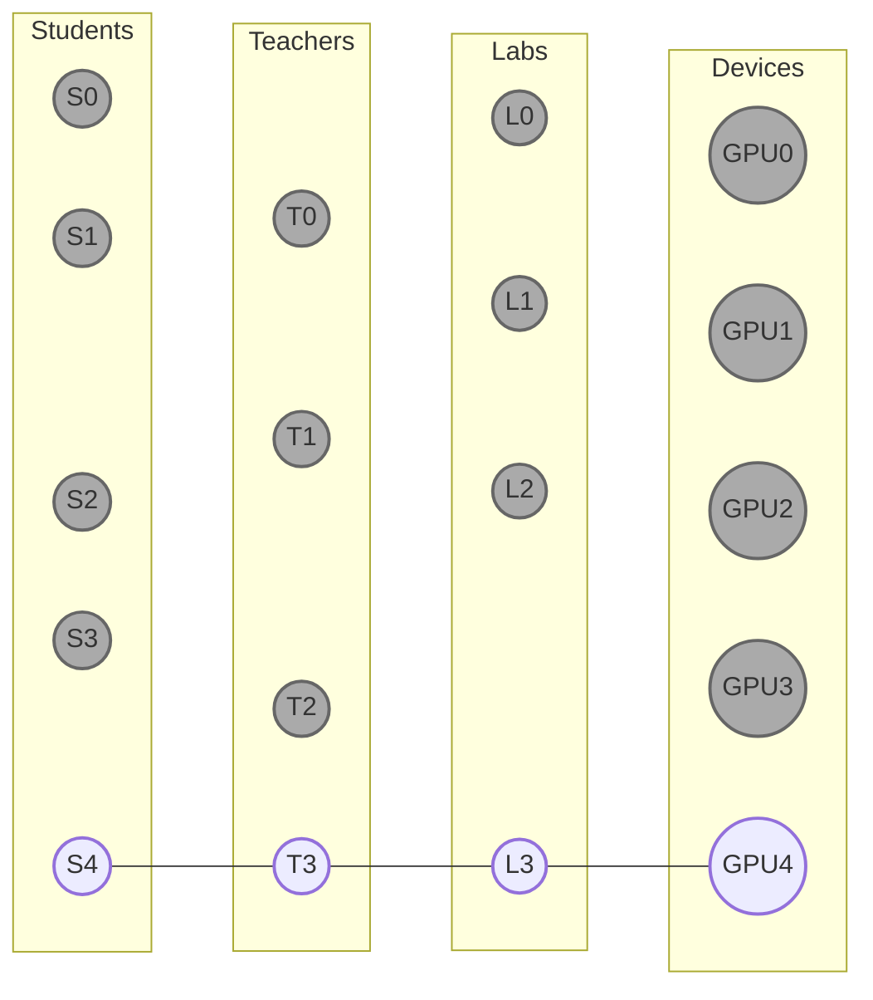

# From Pairwise Join to Global Perspective

## Motivating Example: Different Orders of Pairwise JOINs

**Table 1: Student_Teacher**

| Student | Teacher |
| --- | --- |
| S0 | T0 |
| S0 | T1 |
| S1 | T2 |
| S2 | T2 |

**Table 2: Teacher_Lab**

| Teacher | Lab |
| --- | --- |
| T0 | L0 |
| T0 | L1 |
| T1 | L0 |
| T1 | L1 |
| T2 | L2 |
| T3 | L3 |

**Table 3: Lab_Device**

| Lab | Device |
| --- | --- |
| L2 | GPU0 |
| L3 | GPU0 |
| L3 | GPU1 |

Assume we have the 3 tables above in a database. We allow the same student to have multiple teachers, and the same teacher to guide multiple students, etc.
Now, we want to see **which devices each student can access via the laboratories their teachers belong to**.

Any reader who has used SQL should know how to query this (the SQL below is simplified for demonstration and is not standard syntax):

```sql
SELECT * FROM Student_Teacher
    INNER JOIN Teacher_Lab ON Teacher
    INNER JOIN Lab_Device ON Lab

```

So, how do we obtain the execution results of this SQL statement in the database?

Since this involves three data tables, it is easy to see that we can perform **Pairwise Joins**. There are several options for the order:

**Order 1 (Join Table 1 and Table 2 first)**

```sql
Intermediate_Result = SELECT * FROM Student_Teacher INNER JOIN Teacher_Lab ON Teacher
Final_Result = SELECT * FROM Intermediate_Result INNER JOIN Lab_Device ON Lab

```

**Order 2 (Join Table 2 and Table 3 first)**

```sql
Intermediate_Result = SELECT * FROM Teacher_Lab INNER JOIN Lab_Device ON Lab
Final_Result = SELECT * FROM Student_Teacher INNER JOIN Intermediate_Result ON Teacher

```

**Order 3 (Join Table 1 and Table 3 first)**

```sql
Intermediate_Result = SELECT * FROM Student_Teacher CROSS JOIN Lab_Device
Final_Result = SELECT * FROM Intermediate_Result INNER JOIN Teacher_Lab ON Teacher, Lab

```



Which one is better? **Order 3** involves a `CROSS JOIN` (Cartesian product), so it can basically be ruled out immediately.

For any execution order, the input data (database/tables) is the same, and the output final result must also be the same. The only place where differences can occur is in the **intermediate results**. Let's simulate the execution process.

The intermediate result for **Order 1** is as follows, with a total of **6 rows**:

| Student | Teacher | Lab |
| --- | --- | --- |
| S0 | T0 | L0 |
| S0 | T1 | L1 |
| S0 | T0 | L0 |
| S0 | T1 | L1 |
| S1 | T2 | L2 |
| S2 | T2 | L2 |

The intermediate result for **Order 2** is as follows, with a total of **3 rows**:

| Teacher | Lab | Device |
| --- | --- | --- |
| T2 | L2 | GPU0 |
| T3 | L3 | GPU0 |
| T3 | L3 | GPU1 |

Regardless of the order, the **final result** is as follows, with a total of **2 rows**:

| Student | Teacher | Lab | Device |
| --- | --- | --- | --- |
| S1 | T2 | L2 | GPU0 |
| S2 | T2 | L2 | GPU0 |

It is evident that **Order 2 is superior** because it outputs fewer intermediate results. These intermediate results not only take up memory but also participate in subsequent JOIN calculations, so obviously, the fewer the better.

This is exactly what modern Database Management Systems (DBMS) usually do: use Pairwise JOINs while selecting a potentially optimal JOIN order based on statistics and rules.

## A More Intuitive View

We can represent this database as the path graph below, where each edge represents a row of data in a table:



Consider **Order 1**, which looks for paths that can traverse all fields completely from **Left to Right**:



The intermediate result of Order 1 contains three fields: "Student", "Teacher", and "Lab". There are a total of 6 paths that can go from "Student" to "Lab" (Left to Right), which is exactly the number of rows in the intermediate result.

Similarly, consider **Order 2**, looking for paths from **Right to Left**:



The number of rows in the intermediate result for Order 2 is also equal to the number of paths from the "Device" field to the "Teacher" field.

In fact, whether choosing Left-to-Right or Right-to-Left, both orders produce some **waste** in the intermediate results:

* When going Left-to-Right, reaching L0 and L1 is a dead end (cannot reach a Device).
* When going Right-to-Left, reaching T3 is a dead end (cannot reach a Student).

## Taking it to the Extreme



The example shown above is very extreme: almost all students (S0-S3) chose the same teacher (T0), and almost all devices (GPU0-GPU3) are concentrated in the same lab (L2). However, the most popular teacher (T0) belongs to labs (L0/L1) that **don't have a single machine**...

Assuming this is reality, it is easy to see that after performing the same JOIN query on this database instance, the result should contain only one row:

| Student | Teacher | Lab | Device |
| --- | --- | --- | --- |
| S4 | T3 | L3 | GPU4 |

However, if we adopt the "Pairwise JOIN" scheme, regardless of which JOIN order is chosen, the intermediate results will have 9 rows (interactions between T0's students and L2's devices or similar paths). When the data volume is larger and similar **Data Skew** exists, the waste of computing resources can be immense.

What should we do?

## Global Perspective {#global-perspective}

Let's continue to observe this extreme example. What causes the waste in intermediate results are those **dead-end paths**.
So, is it possible to filter out these dead ends *before* generating intermediate results?

Yes, but the Pairwise JOIN method obviously won't work; we need a **Global Perspective**.

The cause of data expansion is that data rows joining on the same field value in two tables create a Cartesian product. Therefore, we need to avoid performing a JOIN (or strictly speaking, avoid performing an INNER JOIN) before completing the filtering.

Why speak strictly? Because we actually still have to JOIN, but it is a special kind of JOIN: **SEMI JOIN**. It is perfectly suited for this filtering task.

### First Pass: Left to Right

To filter out rows in the right table that cannot JOIN.

```sql
Teacher_Lab_1 = SELECT * FROM Teacher_Lab WHERE EXISTS(
    SELECT * FROM Student_Teacher WHERE (Student_Teacher.Teacher = Teacher_Lab.Teacher)
)

Lab_Device_1 = SELECT * FROM Lab_Device WHERE EXISTS(
    SELECT * FROM Teacher_Lab_1 WHERE (Teacher_Lab_1.Lab = Lab_Device.Lab)
)

```



We guarantee that the filtered data in the right-side table can definitely JOIN with all data tables to its left (including non-adjacent ones).
Therefore, after completing the first pass of filtering, the data remaining in the **right-most table** is guaranteed to participate in the final result.

### Second Pass: Right to Left

To filter out rows in the left table that cannot JOIN.

```sql
Teacher_Lab_2 = SELECT * FROM Teacher_Lab_1 WHERE EXISTS(
    SELECT * FROM Lab_Device_1 WHERE (Teacher_Lab_1.Lab = Lab_Device_1.Lab)
)

Student_Teacher_1 = SELECT * FROM Student_Teacher WHERE EXISTS(
    SELECT * FROM Teacher_Lab_2 WHERE (Student_Teacher.Teacher = Teacher_Lab_2.Teacher)
)

```



We guarantee that the filtered data in the left-side table can definitely JOIN with all data tables to its right (including non-adjacent ones).
Since the first pass guaranteed the right-most data participates in the final result, the second pass ensures that **the remaining data in ALL tables** will participate in the final result.

### Third Pass: Left to Right

To complete the JOIN.

At this point, all paths that do not participate in the final JOIN result have been cleared away. We can now safely perform Pairwise JOINs.

## Summary: Yannakakis Algorithm (Simplified)

What is introduced here is the **Yannakakis Algorithm** specialized for linear JOIN queries. Compared to Pairwise JOIN, its advantage lies in being **sensitive to the result size**.

The complexity of Pairwise JOIN is independent of the JOIN result size. Therefore, even if the final result is actually very small, it may produce a massive amount of intermediate results. For the database instance mentioned above, the time complexity of Pairwise JOIN is $O(N^2)$, whereas the time complexity of the Yannakakis algorithm shown here is $O(N+OUT)$, where $N$ is the data size and $OUT$ is the size of the JOIN result.

The worst-case time complexity for both is consistent.
Assuming there are $K$ data tables with no common attributes, equivalent to doing a full Cartesian product: Pairwise JOIN time complexity is $O(N^K)$, and Yannakakis time complexity is $O(N + OUT)$, where $OUT = N^K$.

JOIN algorithms with $O(N + OUT)$ complexity are also known as **Output-Optimal** algorithms. Regardless of the JOIN algorithm, one must read all the data ($O(N)$) and output all the results ($O(OUT)$), so $O(N + OUT)$ is already optimal for a specific output size.
