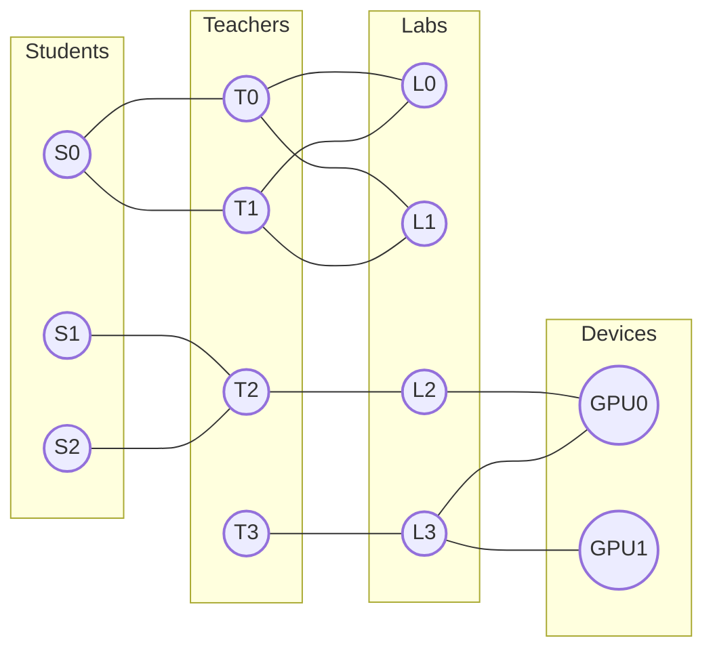
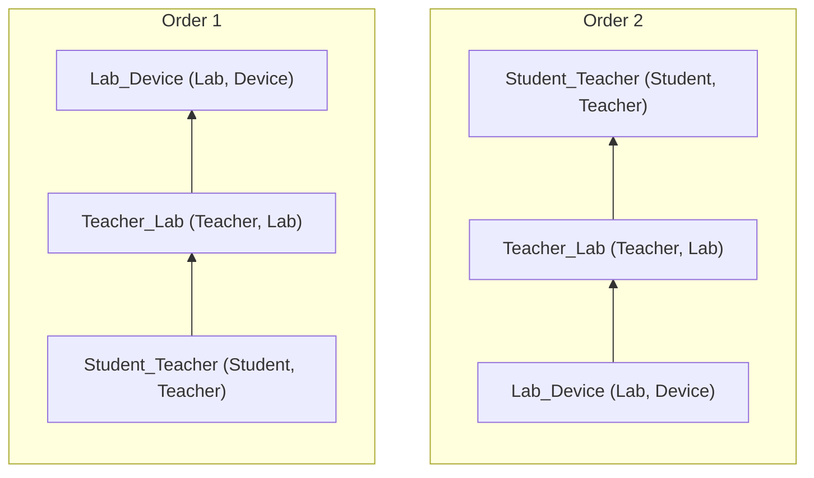
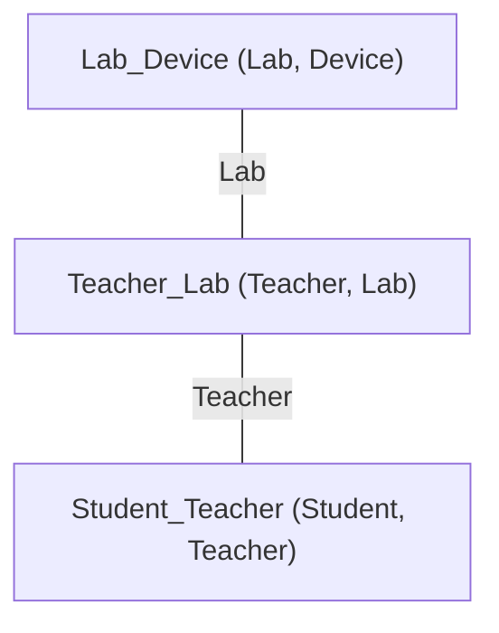
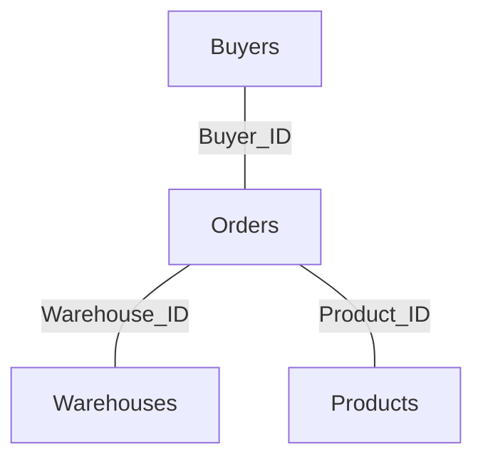
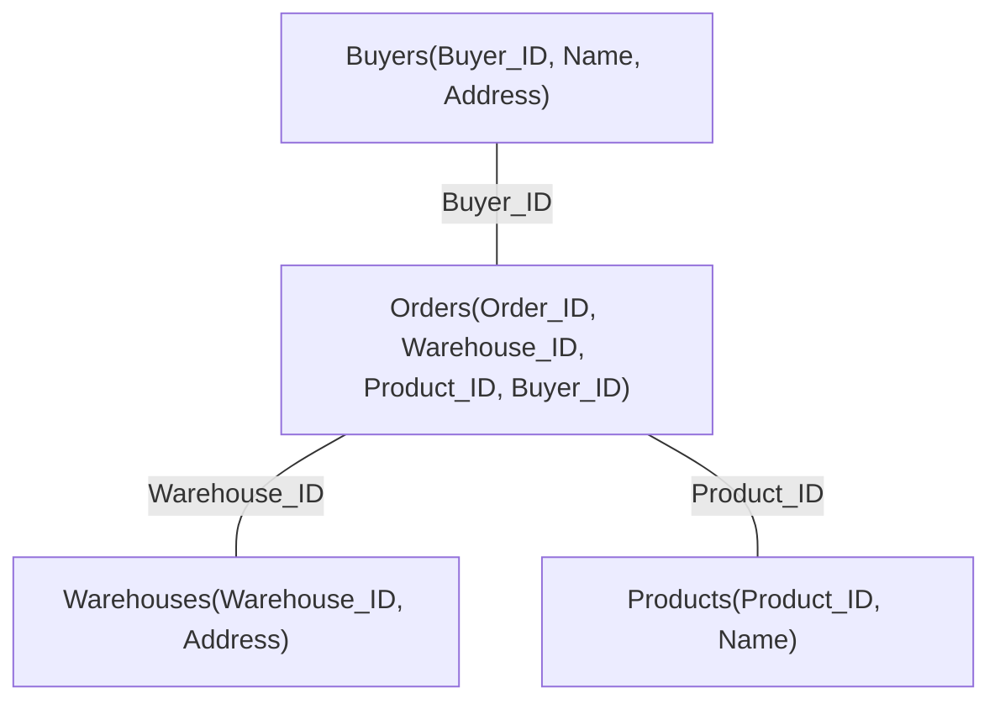

# Graphical Representation of Joins

In the previous note, we discussed the specialized version of the Yannakakis algorithm for linear JOIN queries. However, queries in practice go far beyond just linear structures. So, how do we generalize the Yannakakis algorithm to various types of JOIN queries?

## Graphical Representation

### Recap: Path Graph of a Database Instance

Previously, we showed the path graph of a database instance. This represents the specific data content of a database instance (where every edge represents a row of data in a table):



But now, we want to represent the structure of the JOIN query itself graphically, without involving specific database instances—in other words, in a data-independent way.

### Graphical Representation of Query Plans

Now, disregarding data content, the path graph above transforms into paths between data tables. Considering the Left-to-Right and Right-to-Left orders, we can draw the following two charts:



In a path graph, paths can only be linked if adjacent tables share common attributes. We can mark these common attributes on the edges of the graph. Additionally, if we view this as an undirected graph, we don't need to distinguish between the two orders.



Now, let's consider a slightly more complex example.

### Graphical Representation of Star JOIN Queries

Star JOIN query structures are very common in practice, primarily existing in scenarios using foreign keys.
Assume we have the following data tables:

1. **Orders** (Order_ID, Warehouse_ID, Product_ID, Buyer_ID)
2. **Warehouses** (Warehouse_ID, Warehouse_Address)
3. **Products** (Product_ID, Product_Name)
4. **Buyers** (Buyer_ID, Buyer_Name, Buyer_Address)

We want to retrieve all order details:

```sql
SELECT * FROM Orders
    JOIN Warehouses ON Warehouse_ID
    JOIN Products ON Product_ID
    JOIN Buyers ON Buyer_ID

```

The graphical representation of this query is as follows:



At first glance, this graph might not seem "star-shaped"; it looks more like a tree.
However, if the Orders table had more foreign keys, I believe the reader would understand why this category of queries is called a Star Query.

Additionally, calling it a tree is also correct; a star structure is essentially a tree.
In fact, the graphical representation of a JOIN query is called a **Join Tree**.

## Hypergraphs and Join Trees

We have gained a superficial understanding of Join Trees, but we have not yet provided a formal definition because we are missing a tool—the **Hypergraph**. Hypergraphs can also be used to visually display JOIN queries; the difference is that Hypergraphs merely represent the structure of the JOIN query, while Join Trees imply information about the query execution plan.

### Hypergraph

A Hypergraph $H=(V, E)$ consists of a finite number of vertices and a set of hyperedges, where $V$ represents the finite set of vertices and $E$ represents the set of hyperedges.

Unlike edges in a standard Graph which can only connect two endpoints, a Hyperedge $e \in E$ can connect multiple vertices simultaneously, represented as a subset of vertices in the hypergraph, i.e., $e \subseteq V$.

Hypergraphs map very naturally to JOIN queries:

* Each **vertex** represents a **column (attribute)** in the data tables.
* Each **hyperedge** contains multiple vertices, thus representing a **data table**.

Using the Star Query mentioned earlier as an example:


> [!NOTE]
> In this hypergraph, a "circle" is actually a hyperedge, corresponding to a data table (the table name is connected by a dashed line); each word inside the circle is a vertex, corresponding to a column. 
>
> It took me some time to get used to the graphical representation of hypergraphs—after all, the "edges" in the graphs we usually encounter are represented by thin lines, unlike these "hyperedges" which actually have area.

### Join Tree

The formal definition of a Join Tree corresponds to that of a hypergraph.

Given a hypergraph $H=(V,E)$, its corresponding Join Tree is a tree $T$ that satisfies the following two conditions:

1. The nodes of tree $T$ correspond one-to-one with the hyperedges ($e \in E$) of hypergraph $H$.
2. For any hypergraph vertex $v \in V$, the set of tree nodes in $T$ corresponding to the hyperedges containing $v$ forms a connected subgraph. (This is often called the [**Running Intersection Property**](https://en.wikipedia.org/wiki/Tree_decomposition#:~:text=running%20intersection%20property)).

Let's stick with the previous example. The hypergraph has 4 hyperedges, corresponding to 4 data tables: Buyers, Orders, Warehouses, Products.

Its corresponding Join Tree is as follows. We can see that the Join Tree has 4 nodes, corresponding one-to-one with the 4 hyperedges, thus satisfying the first condition.



The phrasing of the second condition is slightly more complex, but understanding it is quite easy:

* _"Hyperedges containing a common vertex $v \in V$"_ simply means data tables that share a common field (e.g., "Buyers" and "Orders" share the "Buyer_ID" field).
* _"Corresponding nodes in tree $T$"_ refers to finding the tree nodes corresponding to these data tables in the Join Tree (since condition 1 requires a one-to-one mapping).
* _"Forms a connected subgraph"_: This is a basic graph theory concept. For a tree (an undirected graph), if there is a path between two points, they are connected (the path doesn't have to be a direct edge; it can pass through multiple edges).

In the Join Tree above, we can see that the two nodes "Buyers" and "Orders", which share the common field "Buyer_ID", are indeed connected. Iterating through every field can prove that this Join Tree satisfies the second condition.

## Yannakakis Algorithm (Full Version)

With the Join Tree, we can now complete the Yannakakis algorithm introduced earlier on this tree. Unlike before, where we only performed JOINs on a linear sequence of tables, we can now perform JOINs on a tree, thereby supporting more types of queries.

### Let's Recap

The [simplified algorithm flow mentioned in the previous note](01.pairwise-to-global.md#global-perspective) was:

1. **First Pass:** Left to Right, filter out rows in the right-side table that cannot JOIN.
    * After the first pass, data remaining in the right-most table is guaranteed to participate in the final result.
2. **Second Pass:** Right to Left, filter out rows in the left-side table that cannot JOIN.
    * The second pass guarantees that the remaining data in ALL tables will participate in the final result.
3. **Third Pass:** Left to Right, complete the JOIN.

### Generalizing to Join Trees

The characteristics of the two-pass filtering can easily be generalized to a tree structure.

1. **First Pass:** **Bottom-Up** (from leaf nodes up to the root), filtering out rows in parent nodes that cannot JOIN with any child node.
    * After the first pass, the data remaining in the **root node** is guaranteed to participate in the final result.
2. **Second Pass:** **Top-Down**, filtering out rows in child nodes that cannot JOIN with the parent node.
    * The second pass guarantees that the remaining data in **ALL tables** will participate in the final result.
3. **Third Pass:** **Bottom-Up**, complete the JOIN.

### Pseudo-code

**Input:** Join Tree $\mathcal{T}$, Set of Relations $\mathcal{R}$, Root Node $r$.
**Output:** Result of the JOIN $\Join_{e \in \mathcal{T}} R_e$.

1. **Preprocessing: Determine Parent-Child Relationships**  
For each node $e$ in $\mathcal{T}$:  
$p_e \leftarrow$ the parent node of node $e$ in tree $\mathcal{T}$;
2. **Bottom-Up Phase**  
Visit node $e$ of $\mathcal{T}$ in **Bottom-Up** order (excluding root $r$):  
$R_{p_e} \leftarrow R_{p_e} \ltimes R_e$  
_// Filter tuples in parent relation that do not match using child relation_
3. **Top-Down Phase**  
Visit node $e$ of $\mathcal{T}$ in **Top-Down** order (excluding root $r$):  
$R_e \leftarrow R_e \ltimes R_{p_e}$  
_// Filter tuples in child relation that do not match using parent relation_
4. **Compute and Return JOIN Result**  
At this point, all relations have reached "Global Consistency" (every tuple is guaranteed to appear in the final JOIN result):  
Return the natural join of all relations: $\Join_{e \in \mathcal{T}} R_e$

## New Problem: Does Every Query Correspond to a Join Tree?

Suppose we have three data tables: $R(a, b), S(b, c), T(c, a)$.

Consider the following query:

```sql
SELECT * FROM R, S, T WHERE R.a = T.a AND R.b = S.b AND S.c = T.c

```

Can you find the Join Tree that corresponds to it?