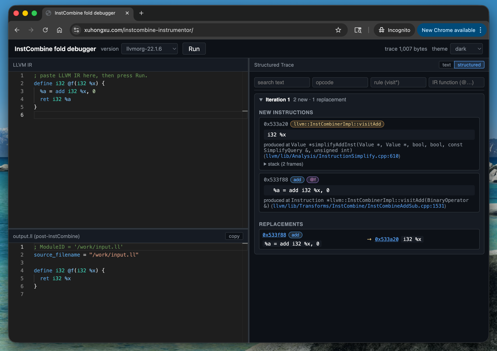

# InstCombine Debugger

<https://xuhongxu.com/instcombine-instrumentor/>

## See Every Rewrite InstCombine Makes --- In Your Browser



[LLVM's InstCombine](https://llvm.org/doxygen/classllvm_1_1InstCombiner.html) is the workhorse peephole pass: it rewrites IR thousands of times per compile, but when one of those rewrites surprises you,
finding out which rule fired, why, and on what value usually means a local LLVM build, printf debugging, and a lot of patience.

> Recommended Reading:
> - [How to Contribute to LLVM --- Nikita Popov](https://developers.redhat.com/articles/2022/12/20/how-contribute-llvm)
> - [How a Single Iteration of InstCombine Improves LLVM Compile Time --- Nikita Popov](https://developers.redhat.com/articles/2023/12/07/how-single-iteration-instcombine-improves-llvm-compile-time)

InstCombine Instrumentor is a browser-based debugger that skips all of that.

Paste IR, hit run, and see exactly what InstCombine did to it ---
instruction by instruction, iteration by iteration.

## What you get

- **Input IR** --- paste any LLVM IR .ll snippet
- **Output IR** --- the IR module after InstCombinePass runs.
- **Trace** --- every new `Value*` created and every RAUW (`ReplaceAllUsesWith`) performed, grouped per fixed-point iteration.

The trace pane has two modes:

- **Structured** (Default) --- collapsible iterations, opcode/rule/function pills, filterable by text/opcode/rule/function, with clickable cross-links between replacements. More user-friendly for interactive debugging and exploration.
- **Text** --- each value tagged with opcode, function/BB, rule, and call-site stack. Better for bug reports and offline analysis.

## Why it's useful

- **No build.** It's *WebAssembly*. <br>
    The wasm bundle ships with the page; no install, no checkout, no toolchain.
- **Pick your LLVM.** <br>
    The version dropdown lists every tagged LLVM release we've bundled (Create a pull request to add more).
    Reproduce a bug against the exact version you're targeting.
- **Frame-accurate traces.** <br>
    Each value is captured at the call site that produced it --- `__FILE__`:`__LINE__` of the wrapping call, plus the
`__PRETTY_FUNCTION__` of the caller --- so you see the rule that fired, not just the leaf `IRBuilder` helper.
- **Same trace, native or browser.** <br>
    We directly patch LLVM's InstCombine source to emit the trace, so the browser and native builds produce the same output.

## Who it's for

- Compiler engineers writing or reviewing InstCombine patches.
- LLVM contributors triaging "this rewrite looks wrong" bug reports without having to build anything.
- Anyone learning how InstCombine works — watching the fixed-point loop unfold on a small example is the fastest way to build intuition.

## Examples

> [!TIP]
> Try a tiny IR snippet first (a couple of adds with a 0 operand will do), flip to the **Structured View**, and watch the rules fire.

```llvm
define i32 @f(i32 %x) {
  %a = add i32 %x, 0
  ret i32 %a
}
```

```llvm
; no rewrite in LLVM 21 and earlier
define i1 @src(i8 %x) {
  %lshr = lshr i8 4, %x
  %trunc = trunc i8 %lshr to i1
  ret i1 %trunc
}
```

```llvm
; no rewrite in LLVM 21 and earlier
define range(i32 0, 7) i32 @src(i32 %0) local_unnamed_addr #0 {
  %2 = insertelement <4 x i32> poison, i32 %0, i64 0
  %3 = shufflevector <4 x i32> %2, <4 x i32> poison, <4 x i32> zeroinitializer
  %4 = tail call i32 @llvm.vector.reduce.add.v4i32(<4 x i32> %3)
  ret i32 %4
}
```