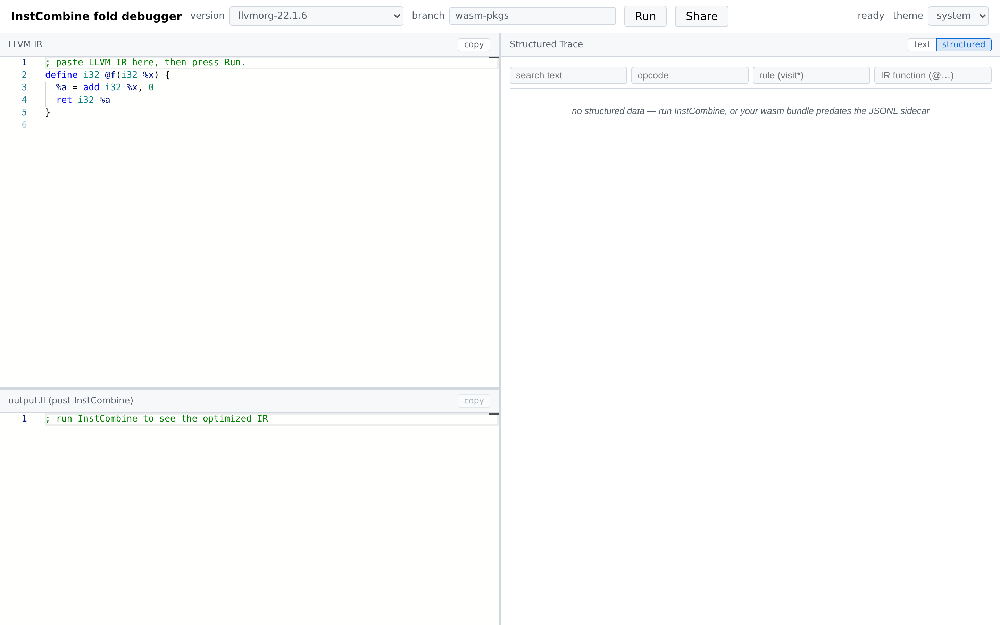
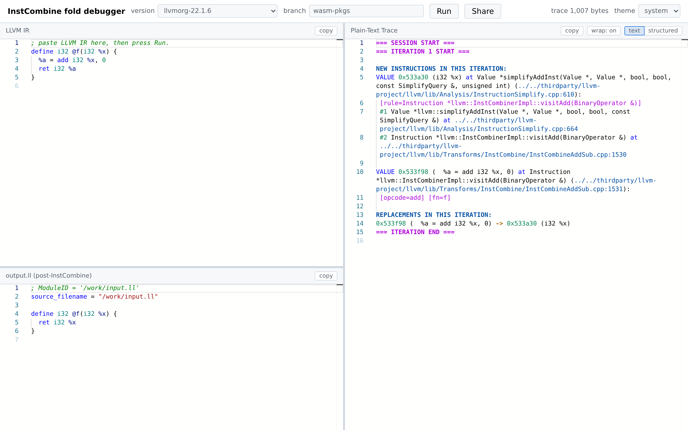
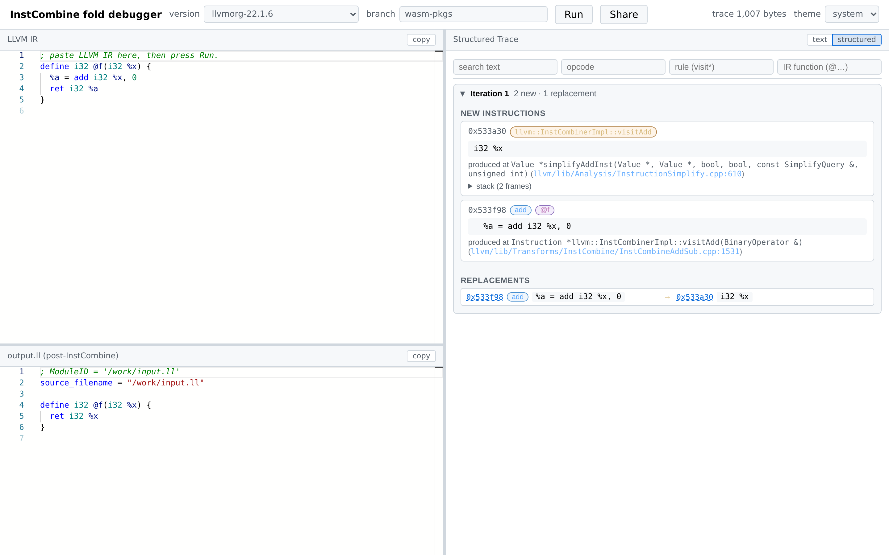
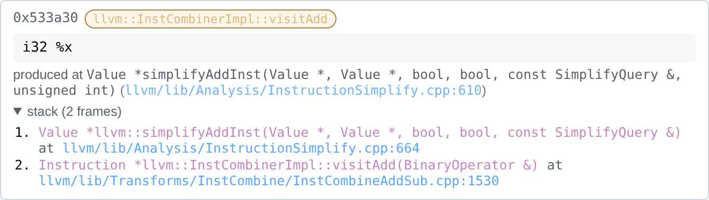
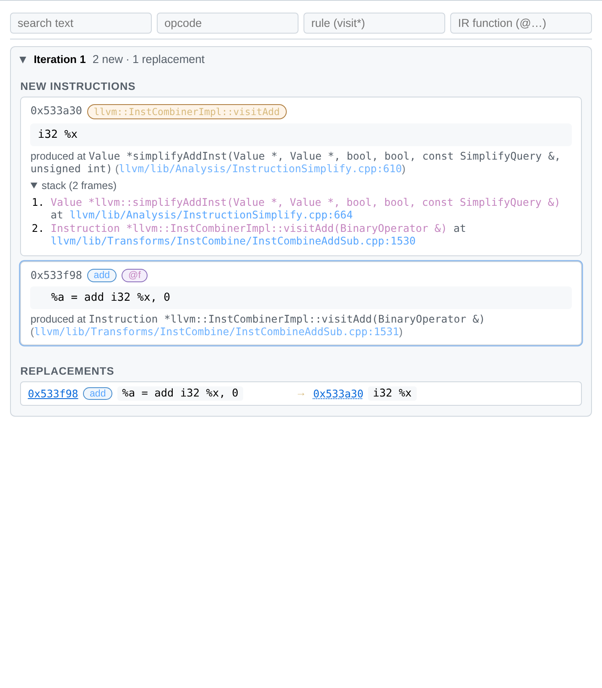
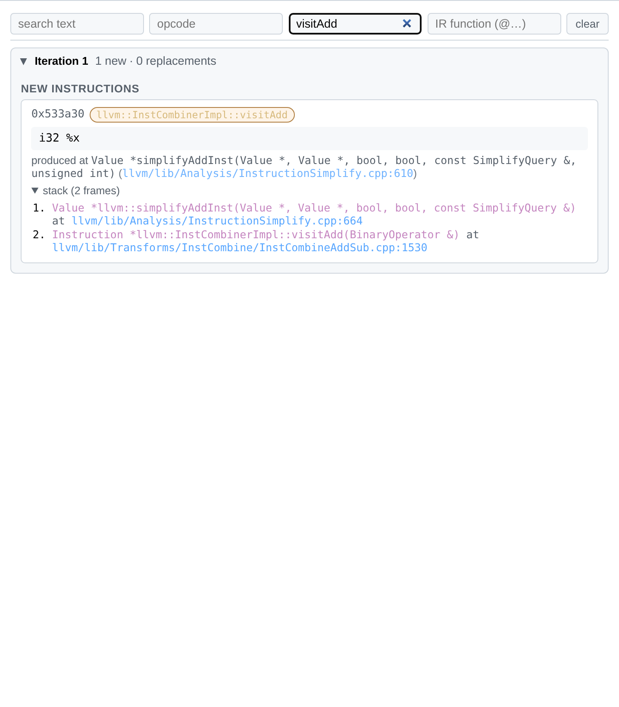
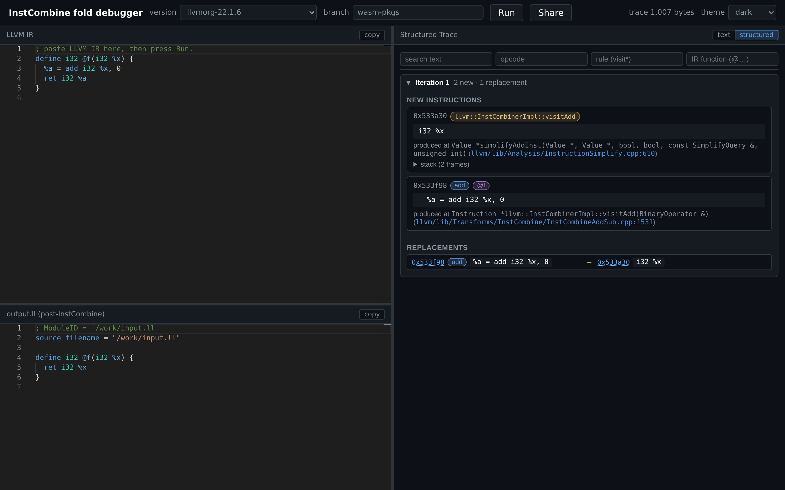
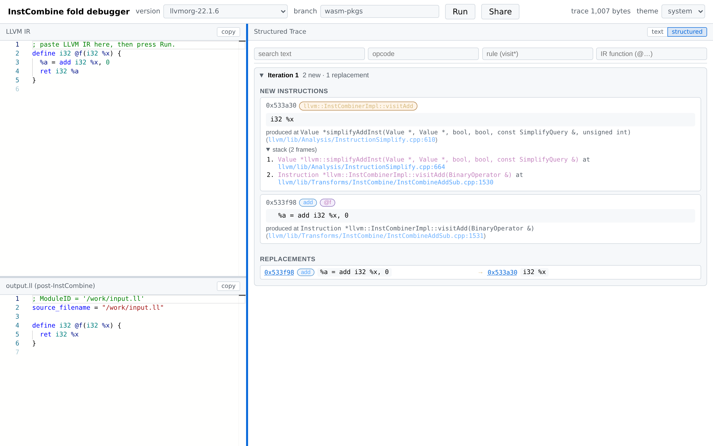

# InstCombine Fold Debugger — User Manual

A browser-based debugger for LLVM's `InstCombine` pass. Paste IR, click **Run**, and inspect every new value, every replacement, and the call stack that produced each one — all without installing anything. Live site: <https://xuhongxu.com/instcombine-instrumentor/>.

This manual has two parts:

- **Part I — Using the webapp** for end users.
- **Part II — Operating the CI** for maintainers who publish new builds.

---

## Part I — Using the webapp

### 1. At a glance

The window is split into three resizable panes:

| Pane | Position | Contents |
|---|---|---|
| **LLVM IR** | top-left | Input editor — paste or edit IR here |
| **output.ll** | bottom-left | Optimized IR after the pass (or driver stderr on parse errors) |
| **Trace** | right | Per-iteration record of new instructions and RAUW replacements |

A toolbar runs across the top with the version picker, branch picker, **Run**, **Share**, a status line, and a theme picker.

### 2. Toolbar

- **version** — Selects which prebuilt LLVM/`InstCombine` wasm bundle to run. Two groups appear in the dropdown:
  - *Tagged releases* (e.g. `llvmorg-22.1.6`) — stable LLVM tags. The newest one is selected by default.
  - *Commit snapshots* (e.g. `main-260524-abc1234567ef`) — daily builds tracking LLVM `main`.

  Selection is remembered per-browser via `localStorage`, and can be preselected via `?tag=…` in the URL.

- **branch** — Picks which GitHub branch supplies the wasm bundles. The default `wasm-pkgs` is the canonical published branch. Override with `?branch=…` in the URL if you've published bundles on a fork.

- **Run** — Runs `InstCombine` on the current IR. Disabled while a wasm bundle is loading or a previous run is in flight.

- **Share** — Copies a permalink to the clipboard. The link encodes the IR (compressed), the selected version, and the branch. The button shows **link copied** for ~1.5 s on success.

- **status** — Right-aligned text: `loading manifest…`, `loading <tag>…`, `running InstCombine…`, `trace <N> bytes`, or an error message.

- **theme** — `system` / `light` / `dark`. Applied instantly to the whole UI and persisted across reloads.

### 3. Editing input IR

The **LLVM IR** pane is a Monaco editor with LLVM-IR syntax highlighting. It comes prefilled with a one-line sample (`%a = add i32 %x, 0`) so you can hit Run immediately. Paste your own IR over it, or load IR from a share link with `?ir=` / `?irz=` URL parameters. The **copy** button in the pane header copies the current contents to the clipboard.

### 4. Running InstCombine

Click **Run**. The wasm driver parses the IR, runs `InstCombine` as a `FunctionPass`, writes the optimized IR back to a virtual filesystem, and dumps the trace. The status line transitions to `trace <N> bytes` when the run completes.

If parsing fails, the **output.ll** pane switches to plaintext mode and shows the driver's stderr — useful for diagnosing malformed IR.

### 5. Output IR pane

Read-only Monaco editor showing `output.ll` from the wasm driver. Word-wrap is off for valid IR and on for error text. The **copy** button copies the visible text.

### 6. Trace pane

The trace pane has two view modes — toggle via the `text` / `structured` segmented control in the pane header. The toggle does not persist across reloads (default is `structured`).

#### 6.1 Text mode

Renders `llvm_fuzz_info.txt` verbatim with custom syntax highlighting for `=== ITERATION …` markers, pointer-arrow replacements, stack frames, and source locations. A **wrap** toggle controls long-line wrapping; **copy** copies the full trace.

#### 6.2 Structured mode

Each `InstCombine` fixed-point iteration is rendered as a collapsible card. Inside an iteration:

- **NEW INSTRUCTIONS** — one card per `Value*` produced during the iteration, showing:
  - Pointer address (clickable cross-link target).
  - Pills for *opcode* (blue), *parent function/block* (purple), *rule* (orange — the `InstCombine` visitor that fired), and *debug location* (green — only when the IR carries DI metadata).
  - The instruction text.
  - "produced at …" with a clickable GitHub link to the source line of the wrapping `__llvm_fuzz_record(...)`.
  - An expandable **stack** showing all outer call sites:

    

- **REPLACEMENTS** — every `Value::doRAUW` from the iteration as `old → new`, each side showing pointer + opcode pill + IR. Pointer addresses are clickable: clicking scrolls to the matching value card and briefly flashes it.

    

A sticky **filter bar** at the top of the structured view narrows the visible records live as you type. Four independent filters compose with AND semantics:

| Filter | Matches |
|---|---|
| **search text** | anywhere in the IR text, function name, or debug location |
| **opcode** | LLVM opcode (`add`, `icmp`, `select`, …) |
| **rule (visit\*)** | InstCombine visitor (e.g. `visitAdd`) |
| **IR function (@…)** | the parent function the value belongs to |

A **clear** button appears once any filter is active.

### 7. Share URLs

Clicking **Share** copies a permalink that re-creates your current session: same IR, same version, same branch.

Supported URL parameters:

| Param | Meaning |
|---|---|
| `?irz=<base64url>` | Modern: compressed IR (DEFLATE-raw with a small built-in dictionary). |
| `?ir=<base64url>` | Legacy: uncompressed IR. Still accepted; produced as fallback when the browser lacks CompressionStream. |
| `?tag=<version>` | Preselect a wasm version. |
| `?branch=<name>` | Preselect the artifact branch. |

### 8. Theme & layout

Use the **theme** picker for `system` / `light` / `dark`.

All three pane boundaries are draggable. Layout is auto-saved per browser; reload restores your widths.

### 9. Troubleshooting

| Symptom | Cause / fix |
|---|---|
| Status stuck on `loading manifest…` | The browser can't reach `raw.githubusercontent.com`. Check ad-blockers and corporate proxies. |
| Status stuck on `loading <tag>…` | First-time fetch of a ~30 MB wasm bundle. Subsequent loads are cached. |
| **output.ll** shows non-IR text | The driver couldn't parse the input IR. The pane content is the driver's stderr. |
| `no structured data — your wasm bundle predates the JSONL sidecar` | The selected bundle is older than the structured-trace feature. Pick a newer version or stay in **text** mode. |
| Share link doesn't restore the IR | The link was generated by an older webapp version; the IR fragment may be truncated. |
| Pane handle won't drag | Resize handles are 4 px wide — aim carefully; the cursor changes to `col-resize` / `row-resize` when you're on one. |

---

## Part II — Operating the CI

The repository ships two independent publishing tracks:

- **Native `opt` releases** — GitHub Releases under tag `release/<llvm-ref>`, each carrying a Linux x86_64 tarball of patched `opt` + `llvm-symbolizer`.
- **Wasm bundles** — directories committed to the orphan `wasm-pkgs` branch, fetched at runtime by the webapp via `raw.githubusercontent.com`. The webapp's version dropdown is populated from `wasm-pkgs/manifest.json`.

The two tracks share toolchain helpers (`.github/scripts/shared/`) but no scheduling — bumping an LLVM version in one does not implicitly bump the other.

### 10. Workflow map

| Workflow | Triggers | Produces |
|---|---|---|
| `native-build.yml` | push / PR / `release/*` tag | Build matrix for native `opt`; attaches tarball to the Release on tags. |
| `native-release-auto.yml` | Mon 05 UTC cron + `workflow_dispatch` | Pushes `release/llvmorg-X.Y.Z` for new upstream stable tags and dispatches `native-build.yml`. |
| `native-release-manual.yml` | `workflow_dispatch` | Same as auto, but for an arbitrary LLVM tag or commit SHA. |
| `native-weekly-canary.yml` | Mon 06 UTC cron + `workflow_dispatch` | Native build against LLVM `main` tip — pure breakage detector. No release. |
| `wasm-verify.yml` | push / PR (wasm paths) + `workflow_dispatch` | Builds + smoke-tests wasm; uploads a 14-day `wasm-bundle-latest` artifact. Does **not** publish. |
| `wasm-publish.yml` | Mon 05 UTC + every 3 days 06 UTC cron + `workflow_dispatch` | Builds and publishes wasm bundles to `wasm-pkgs`, regenerates `manifest.json`. |
| `wasm-custom-publish.yml` | `workflow_dispatch` | Publishes a wasm bundle from a fork or alternate LLVM source URL. |
| `wasm-pages.yml` | push to `main` (web paths) / PR / Mon 09 UTC cron + `workflow_dispatch` | Deploys the SPA to GitHub Pages; bakes the wasm-pkgs manifest URL. |

All build workflows share ccache via `actions/cache@v4` keyed off `llvm_commit.txt` so PRs, push-to-main, and Release tags targeting the same LLVM version reuse each other's compile cache. Helper scripts are grouped per-workflow under `.github/scripts/`.

### 11. Native `opt` releases

#### 11.1 `native-build.yml`

Runs on every push and PR for verification, and on `release/*` tags it bundles `opt` + `llvm-symbolizer` into `opt-llvm-<short-sha>.tar.xz` and attaches it to the matching GitHub Release. No manual dispatch is needed for the normal flow — pushing a `release/*` tag is enough.

#### 11.2 `native-release-auto.yml`

Scheduled **Monday 05:00 UTC**, also `workflow_dispatch`-able. Scans `llvm/llvm-project` for stable `llvmorg-X.Y.Z` tags that don't yet have a matching `release/<tag>`, picks the newest `max_tags`, and for each missing tag pushes a `release/<llvm-tag>`, pre-creates the GitHub Release, then explicitly dispatches `native-build.yml` against that tag.

Inputs:

| Input | Default | Meaning |
|---|---|---|
| `max_tags` | `1` | Maximum number of missing upstream tags to release this run. |
| `dry_run` | `false` | Print the plan without pushing tags or dispatching builds. |

#### 11.3 `native-release-manual.yml`

`workflow_dispatch`-only companion to the auto workflow. Use it to release any LLVM ref off-cron.

Inputs:

| Input | Required | Meaning |
|---|---|---|
| `llvm_ref` | yes | Either an `llvmorg-*` tag or a 7–40 hex commit SHA. Branches are rejected. |
| `dry_run` | no (`false`) | Print the plan without pushing or dispatching. |

Tag derivation: `release/<llvm_ref>` for tags; `release/<YYMMDD>-<first-12-hex>` for SHAs (date pulled from the GitHub commit metadata).

#### 11.4 `native-weekly-canary.yml`

Scheduled **Monday 06:00 UTC**, also `workflow_dispatch`-able. Builds native `opt` against an LLVM ref (defaults to `main`) without attaching a Release. Use it to detect upstream LLVM changes that break the patcher early.

Inputs:

| Input | Default | Meaning |
|---|---|---|
| `llvm_ref` | `main` | Branch, tag, or commit SHA to build. |

### 12. Wasm bundles

#### 12.1 `wasm-verify.yml`

Push/PR (paths gated to wasm-relevant files) and `workflow_dispatch`. Builds the wasm bundle and runs `wasm/test/smoke_wasm.mjs`, then uploads a 14-day workflow artifact `wasm-bundle-latest` so reviewers can preview a PR build locally. No publishing to `wasm-pkgs`, no Release attachment, no inputs.

#### 12.2 `wasm-publish.yml`

The main wasm publishing pipeline. Crons:

- **Mon 05 UTC** — `weekly-stable` mode: publish the newest missing stable LLVM tag.
- **Every 3 days 06 UTC** — `daily-main` mode: publish a snapshot of LLVM `main` HEAD.

`workflow_dispatch` exposes a `mode` choice that selects the same logic on demand:

| Input | Default | Meaning |
|---|---|---|
| `mode` | `specific-ref` | `weekly-stable` / `daily-main` / `specific-ref` / `rebuild-existing`. |
| `llvm_ref` | `''` | `specific-ref` only — `llvmorg-*` tag or 7–40 hex SHA. Comma-separated list accepted. |
| `max_tags` | `1` | `weekly-stable` only — max missing stable tags to build this run. |
| `prune_main` | `7` | `daily-main` only — number of `main-*` snapshots to retain. |
| `force_rebuild` | `false` | Skip the "already on `wasm-pkgs`" short-circuit. |
| `dry_run` | `false` | Build but don't push to `wasm-pkgs`. |

`rebuild-existing` enumerates every published directory and rebuilds each from its corresponding LLVM ref — useful after a patch fix that affects all targets. Only the `finalize` job is mutex-serialized (`group: wasm-pkgs`), so overlapping runs can build in parallel.

#### 12.3 `wasm-custom-publish.yml`

`workflow_dispatch`-only. Publishes a wasm bundle for an LLVM ref hosted in a *fork* or otherwise not on `llvm/llvm-project`.

Inputs:

| Input | Required | Meaning |
|---|---|---|
| `llvm_source_url` | yes | GitHub URL of the form `/tree/<branch-or-sha>` or `/commit/<sha>`. Accepts `/commits/` too. |
| `dry_run` | no (`false`) | Build but do not push the artifact branch. |

Branch-backed refs are normalized to commit SHAs by `.github/scripts/wasm-publish/resolve_custom_source.mjs` before checkout, so subsequent rebuilds remain reproducible.

#### 12.4 `wasm-pages.yml`

Builds and deploys the SPA at <https://xuhongxu.com/instcombine-instrumentor/>. Triggers: push to `main` (web paths), PR (build only — no deploy), Mon 09 UTC cron, and `workflow_dispatch`.

At build time `web/scripts/build-manifest.mjs` fetches the canonical `wasm-pkgs/manifest.json` and rewrites it according to a bundle mode. The webapp also reads `VITE_REMOTE_MANIFEST_URL` (baked into the bundle) and prefers the live manifest at runtime, so the same-origin copy is a fallback for offline / blocked-CDN users.

Inputs:

| Input | Default | Meaning |
|---|---|---|
| `bundle_mode` | `remote` | `remote` (every version stays on raw.githubusercontent.com), `hybrid` (force-includes + N newest stable tags), or `bundled` (everything same-origin). |
| `bundle_count` | `5` | `hybrid`/`bundled` — max auto-picked entries (force-includes are additional). |
| `include_commit_count` | `0` | `hybrid` — additionally bundle the N newest `main-*` snapshots. |
| `must_bundle` | `''` | CSV of additional tags or SHA prefixes to force-bundle, appended to `wasm-must-bundle.txt`. |

### 13. Common maintainer recipes

- **Publish wasm for a brand-new stable tag** — dispatch `wasm-publish.yml` with `mode=specific-ref`, `llvm_ref=llvmorg-X.Y.Z`.
- **Try a build before pushing to `wasm-pkgs`** — dispatch `wasm-publish.yml` with `dry_run=true`; the workflow artifact contains the staged outputs.
- **Force-bundle one version into the Pages deploy** — append the version directory name to `wasm-must-bundle.txt`, push to `main`, then dispatch `wasm-pages.yml` with `bundle_mode=hybrid`.
- **Publish a wasm bundle from a fork** — dispatch `wasm-custom-publish.yml` with the GitHub source URL (`https://github.com/<you>/<fork>/tree/<branch-or-sha>`).
- **Release native `opt` for an arbitrary SHA** — dispatch `native-release-manual.yml` with `llvm_ref=<sha>`; wasm for the same SHA is a separate `wasm-publish.yml` dispatch.
- **Re-publish every wasm bundle after a patcher fix** — dispatch `wasm-publish.yml` with `mode=rebuild-existing`, optionally `dry_run=true` first.
- **Detect upstream breakage before a release** — let `native-weekly-canary.yml` run on Mondays, or dispatch it ad-hoc against `llvm_ref=main`.

### 14. Useful environment knobs

| Variable | Where | Default | Effect |
|---|---|---|---|
| `DISABLE_INSTCOMBINE_TRACE` | native `opt` runtime | unset | `1`/`true` makes the patched `opt` behave like stock `opt` — no trace file, no overhead. |
| `LLVM_PARALLEL_LINK_JOBS` | `build_patched_llvm.sh` | `1` | Raise on machines with plenty of RAM to speed up linking. |
| `VITE_BASE` | `web/` build | `/instcombine-instrumentor/` | Override Vite `base` for local previews (`VITE_BASE=/`). |
| `VITE_REMOTE_MANIFEST_URL` | `web/` build | this repo's `wasm-pkgs` raw URL | Override the manifest source for forks. |
| `BUILD_DIR` | native build | `build/llvm-rel` | CMake build directory. |
| `WASM_BUILD_DIR` | wasm build | `build/llvm-wasm` | Emscripten build directory. |

A fuller list lives in `CLAUDE.md` for engineering details.
